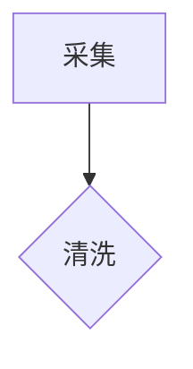

# mslang-js

轻量级排版语言 mslang 的 JavaScript 实现，面向 **AI 文献工作台**的论文写作：结构化标记、文献/术语/图表引用体系、表达式与动态数据、跨文档合并、异步渲染。

## 项目结构

```
mslang/
├── package.json         # npm 包配置 (ES Module)；npm test 运行测试套件
├── index.html           # 浏览器端交互式演示页面（需 HTTP 服务打开，file:// 下 ES Module 受限）
├── src/
│   ├── index.js         # 入口模块，唯一入口 render()（async/合并/块级均为配置项）
│   ├── tokens.js        # Token 类型枚举、Position、Token 类
│   ├── lexer.js         # 词法解析器 (源文本 → Token 流)
│   ├── expression.js    # 表达式解析器与求值（递归下降，变量/函数/字面量）
│   ├── nodes.js         # AST 节点定义 (Document, Heading, Paragraph, ...)
│   ├── parser.js        # 语法解析器 (Token 流 → AST) + mergeDocuments（内部）
│   ├── builtin.js       # 内置函数 (if/cite/term/ref/set/let/bibliography...)
│   ├── renderer.js      # HTML 渲染器 (AST → HTML，Visitor 模式)
│   └── escape.js        # HTML 转义纯函数（builtin/renderer 共用）
├── test/                # 测试套件（node:test，87 项）
└── dist/                # 构建产物 (esm / iife / iife.min)
```

## 架构

```
源文本 → Lexer → Token 流 → Parser → AST → Renderer → HTML
                    ↑                        ↑
              expression.js            builtin.js（内置函数）
```

- Lexer 是**唯一的行内语法识别器**；Parser 只做 Token → AST 映射
- 渲染管线：`parse → _applySets（@set/@let 预扫描）→ _collectRefs（编号收集）→ accept`
- 编号体系（cite/图/表/节）在 `_collectRefs` 一次遍历完成，跨文档合并后天然全局连续

## 使用方式

```javascript
import { render, HTMLRenderer, Parser } from 'mslang';

// 唯一入口：字符串渲染；传数组自动合并（跨文档连续编号）；async/块级均为配置项
const html = render('# Hello\n\n**bold** text');

// 论文写作：cite 自动编号、@ref 交叉引用、@bibliography 文献表
const paper = render(
  '# 引言 {#sec:intro}\n\n' +
  '如 @ref("fig:1") 所示，结果见 @cite("doe2020")。\n\n' +
  '{#fig:1}\n\n' +
  '见 @ref("sec:intro")。\n\n@bibliography()',
  { data: { bibliography: { doe2020: { authors: 'Doe, J.', year: 2020, title: 'A Study' } } } },
);
```

### 图表 caption

图表后一行 `{#label} 说明`（label 必须与图表 label 一致；孤立/不匹配时降级为普通段落）：

```
{#fig:1}

{#fig:1} 实验装置示意图        → <figure id="fig:1"><figcaption>图 1：实验装置示意图</figcaption></figure>

| x |{#tbl:t}|
|---|
| 1 |

{#tbl:t} 数据统计              → <table id="tbl:t"><caption>表 1：数据统计</caption>...
```

前缀可配置：`@set({ captionPrefix: { fig: "Figure", tbl: "Table" } })`（默认 `图/表`，`@ref` 显示与 caption 一致）。

### 文档内配置与变量

```javascript
// @set：配置写在 md 里（覆盖 API 同名选项，全文档生效，建议放开头）
// 白名单键：headingNumbering / refNumbering / escapeHtml / pretty / data /
//           variables / terms / bibliography / captionPrefix /
//           citeKeyAttr / termKeyAttr / refKeyAttr
render('@set({ headingNumbering: "1.1", refNumbering: "1" })\n\n# 引言 {#sec:intro}');

// @let：变量声明（预扫描注册，全文档可见；同名覆盖；值可为任意表达式）
render('@let("threshold", 5)\n\n@if(threshold > 3, "达标", "不足")');

// terms/bibliography 顶层键增量合并（多次 @set 按 key 合并；字符串值即显示文本）
render('@set({ terms: { 词干提取: "词干提取 (Stemming)" } })\n\n@term("词干提取")');
```

### 跨文档合并渲染

```javascript
// 多文档：编号跨文档连续、交叉引用、@set/@let 全局生效（顺序即编号顺序）
const html = render(['引言.md', '方法.md', '参考文献.md'], { data: {...} });
// 异步：render(src, { async: true }); AST 层：Parser.parseText / dumpAST
```

### 公式（LaTeX 语法，内置 KaTeX 渲染）

```
行内：质能方程 $E = mc^2$ 是核心
块级：$$ \int_0^1 x dx $$
带编号：$$ E = mc^2 $$ {#eq:energy}          → @ref("eq:energy") 显示"式 1"
带说明：$$ x = 1 $$ {#eq:a}

{#eq:a} 归一化条件                            → <figure><div class="math">…</div><figcaption>式 1：…</figcaption></figure>
```

- `$...$` 行内（限同行）、`$$...$$` 块级（可跨行）；`\$` 转义字面美元；未闭合回退普通文本
- **默认内置 KaTeX 渲染**（`katex` 为正式依赖，开箱即用）：行内 `<span class="math-inline">` / 块级 `<div class="math">` 容器内为 KaTeX 输出（MathML + HTML 双轨）
- `mathRenderer` 选项可覆盖默认渲染（如自定义 KaTeX 选项或换其他引擎）；`throwOnError: false` 容错渲染错误公式
- 编号体系与图/表统一：`captionPrefix` 默认含 `eq: '式'`，跨文档合并自动连续

### 插件（文档内自定义函数，默认开启）

```md
@plugin("double", "(x, kwargs) => x * 2")     // new Function 编译，签名与内置一致 (...args, kwargs)
@double(21)                                    →  42

@plugin("ul", `(items) => items.map(i => "<li>" + i + "</li>").join("")`)
@ul(["a", "b"])                                →  <li>a</li><li>b</li>

@plugin("fetch", `async (u) => "<b>" + u + "</b>"`)   // 异步插件需 { async: true }
```

- 预扫描阶段注册（与 `@set`/`@let` 同机制），**全文档可见、跨文档合并可用**；可覆盖内置/宿主同名函数；同 body 编译缓存
- **默认开启**；`allowPlugins: false`（API 或 `@set`）可关闭——关闭后 `@plugin` 不注册，调用输出错误注释
- ⚠️ **安全提示**：插件函数体是真实 JS（`new Function` 全局作用域），文档即代码——仅在可信文档上开启
- 函数体无法捕获文档内 `@let` 变量（全局作用域），请通过参数/kwargs 传值

### 块级编辑（render 的 blocks 配置）

```js
import { render } from 'mslang';

const { html, blockHashes } = render(source, { blocks: true });
// html: 含 <!--mslang:N--> 块哨兵（footnotes 区为 <!--mslang:footnotes-->）
// blockHashes[N] = 块源 + 编号前缀快照哈希 → 编辑后重渲，对比哈希定位变化块

// 宿主侧流程（编辑块 i 后）：
//   1. 替换 source 中该块的 [startPos, endPos) 区间（Parser.parseText 产物带
//      blocks[i].startPos / endPos / raw 块源文本）
//   2. 重新 render(source, { blocks: true }) 全量渲染（parse 微秒级，公式/代码命中缓存）
//   3. 对比新旧 blockHashes，只 DOM 替换哈希变化的块区间（编号依赖自动传播：
//      块 i 加图 → 块 i..N 哈希全变）
```

- 块区间：`blocks[i].startPos/endPos/raw`——区间连续覆盖文档源；caption 归并行并入前块；脚注定义行不属于任何块（截断）
- 编号传播正确性：哈希含块渲染时的编号前缀快照（fig/tbl/sec/eq/cite/term 计数），块 i 之后编号变化 → 后续块哈希变
- 默认 render 无哨兵（blockMarkers 默认 false，零回归）

### 引用样式与术语表

```js
// citeStyle: numeric（默认上标 [n]）/ author-year（(Doe, 2020a)）/ author（(Doe)）
render('@cite("doe2020")\n\n@bibliography()', {
  data: { bibliography: { doe2020: { authors: 'Doe, J.', year: 2020 } } },
  citeStyle: 'author-year',   // 或 @set({ citeStyle: "author-year" })
});
// author-year: 正文 (Doe, J., 2020)；文献表按作者+年份排序的 <ul>；
// 同年同作者自动消歧 a/b；缺 authors 回退数字编号

// @glossary(): 术语表（按引用首次出现顺序），label — desc（可选），url 可链接
render('@term("词干提取")\n\n@glossary()', {
  data: { terms: { 词干提取: { label: 'Stemming', desc: '词形还原', url: 'https://x' } } },
});
```

### 代码高亮（内置 highlight.js）

```
```js
const a = 1;
```
```

- 内置 highlight.js（14 种常用语言子集），文档含高亮代码块时自动内联 github 主题 `<style>`（与公式 CSS 同机制）
- 输出 `<code class="hljs language-js">`，hljs 渲染已转义（`escapeHtml: false` 下也安全）
- 未知/无语言代码块保持原样；mermaid 块走流程图渲染不受影响

### 流程图（mermaid）

```


{#fig:flow} 数据采集流程        → <figure id="fig:flow"><div class="mermaid">…</div><figcaption>图 N：…</figcaption></figure>
```

- ```` ```mermaid {#fig:flow} ```` 起始行行尾 `{#label}` 提取 label；无 label 时输出纯 `<div class="mermaid">`
- 浏览器端引入 `mermaid.min.js` 后 `mermaid.run()` 自动渲染成 SVG；Node 服务端可用 `codeRenderer` 钩子（`(source, language) => svgHtml`）
- **与图片共享 fig 编号序列**（图 1、图 2 连续），`@ref("fig:flow")`、caption 归并、跨文档合并全部复用
- 普通代码块（js 等）行为不变；其 label 不参与编号

### 引用元数据（工作台交互）

`cite`/`term`/`ref` 输出携带 data 属性（点击证据 → 工作台定位文献库）：

```html
<a href="#cite-1" id="ref-cite-1" data-cite-key="doe2020" data-cite-index="0">[1]</a>
```

属性名可配置（`@set` 或 API 选项，空串关闭）：`citeKeyAttr`（默认 `data-cite-key`）/ `termKeyAttr`（默认 `data-term-key`）/ `refKeyAttr`（默认 `data-ref-label`，附带 `data-ref-kind`）。属性值恒转义（`escapeHtml: false` 时也防注入）。

### 异步渲染

```javascript
const renderer = new HTMLRenderer();
renderer.addFunction('fetch_title', async (key) => `<b>${key}</b>`);
const html = await render('标题：@fetch_title("paper1")', { async: true }); // 或 renderer.renderAsync
```

### 其余 API

- AST：`Parser.parseText(source)` / `Parser.parse(tokens)` / `dumpAST(doc)`（块级编辑取块区间用）
- 渲染器：`new HTMLRenderer({ functions, escapeHtml, pretty })`，`render / renderAsync / renderAll / renderAllAsync / renderBlocks`，`addFunction(name, fn)`

## 测试

```bash
npm test    # node:test 运行 test/ 下 87 项测试（零新依赖）
npm run build  # esbuild 构建 dist/（esm / iife / iife.min）
```

## 设计原则

- **显式优于隐式**：caption 需 `{#label}` 显式声明；`@ref` 显示"标题全文/编号"由配置显式决定
- **容错**：表达式错误、未知函数输出 HTML 注释而非崩溃（AI 生成场景友好）
- **零核心依赖**：KaTeX/Mermaid 等渲染器通过钩子/选项注入，核心库纯 JS
- **编辑层与出图层分离**：mslang 负责写作/交互（动态、容错、AST 可编程），最终 PDF 可由 `mslang → .typ` 转换链路交给 Typst 原生编译
